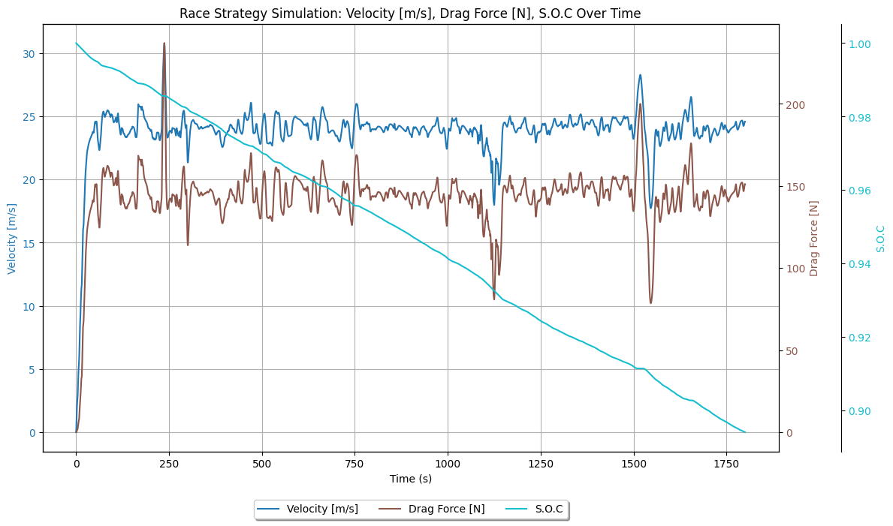

# Race Strategy
Welcome to the GitHub Repository for the Race Strategy Team at Badger Solar Racing! Here is an overview of our system.
## The Goal of Race Strategy
We are building a solar race car, and we want to drive wisely. Thus came the ultimate mission of the race strategy team: to unlock the car’s full potential by determining the **optimal driving strategy**. We aim to balance speed, battery efficiency, and distance coverage while adapting to real-time conditions like weather and terrain. By combining advanced simulations, data analysis, and physical insights, we empower our driver with precise, actionable guidance to maximize performance and win the race.

## Tools for Race Strategy

### Matlab, Simulink, Python, and Physical Intuitions 
In the quest to study the dynamics and behavior of the car, we are building a simulated model of our solar car using Simulink on Matlab.
Personally, Simulink is fairly easy to get started (it's kinda like Scratch). Matlab on the other hand is both interesting and frustrating, so one would need a fair fluency in the language, as well as a good temper.
The model of the car is built on models of each small section, and their interaction. We mainly follow the physics of each piece in building the model, and a trustworthy physical intuition.

Python serves as the backbone of our data pipeline system, functioning as the bridge between our MATLAB simulation and real-world telemetry data. We leverage Python's extensive libraries for:
- Data collection from onboard sensors (stored in Redis Database)
- Real-time processing and cleaning of telemetry data
- Integration with weather APIs and route data
- Custom interfaces that allow our Simulink simulations to be called from Python

## The Dichotomy of Race Strategy System

### The Simulation
As mentioned above, our simulation involves a model of the solar car. But that's not all to it. To study the car's behavior in different environments and weather, we have to also consider external conditions and their impact on the car. The overall simulation can be broken down into two big parts:
1. Interaction among different components of the car
2. The Car's response to external conditions

### High Level Overview of Race Strategy Systems

1. **Data Pipeline System**: This system bridges the gap between our simulation and reality by:
- Collecting telemetry data from the actual car during testing/racing
- Processing this data to feed into our simulation model
- Enabling real-time updates to our strategy based on current conditions
- Creating a closed-loop feedback system where actual performance informs simulation refinements

2. **The Simulation System**: The simulation is the foundation of race strategy, built on MATLAB/Simulink. It consists of two main components:
- Interaction among different components of the car subsystem (motor, battery, solar array, etc.) that model their physics and behavior
- The car's response to external factors like weather, terrain, and race conditions affect the car's performance

3. **The Optimizer System**: Our ultimate goal is to have the confidence to tell the driver to drive at a certain speed at a certain location, so that we keep a good balance between battery consumption and distance coverage, while considering physical constraints and weather prediction for the next several hours:
- **Uses mathematical optimization** (specifically `fmincon` constrained optimization) to find optimal power settings
- **Maximize distance traveled** by systematically evaluating different power configurations 
- **Set constraints** on power usage (e.g., between 100-1000 kW) to maintain feasibility
- **Balance computational efficiency** with solution quality through limited iterations and function evaluations
- **Validate results** by simulating the optimized parameters to verify performance
- **Generate specific target power values** that can be translated into driver instructions
- **Provide quantitative performance predictions** (e.g., maximum distance traveled) for the optimized strategy
- **Interface directly with the simulation model**

4. **Validation & Fine-Tuning**: We still need to match the simulated car to the actual car. This means that we need to analyze data from future test drives and retrieve parameters for our model. Since we are building a new car simultaneously, this would not be our main focus this semester. However, it would still be helpful to work with Mechanical to come up with a better methodology for test-drive data analysis.
